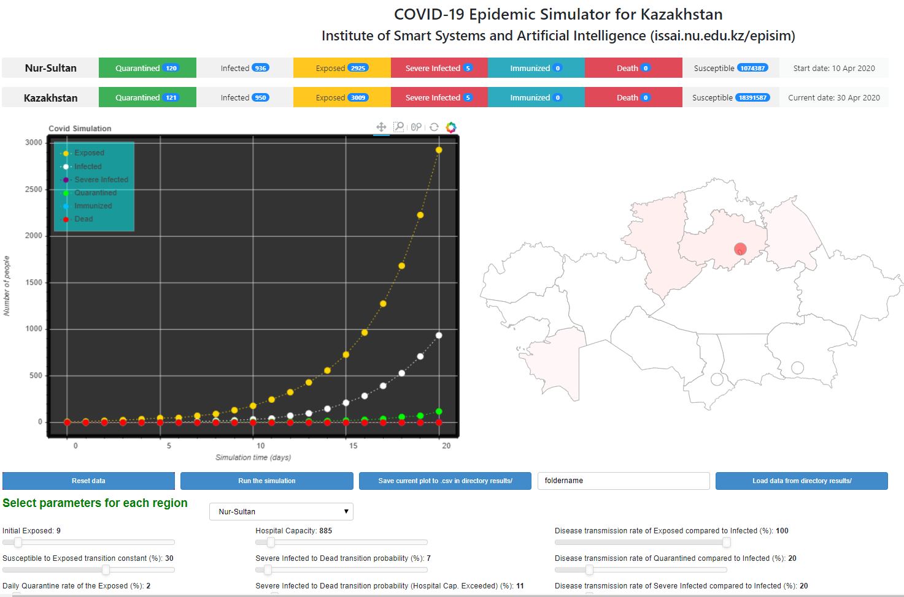

# A Network-Based Stochastic Epidemic Simulator: Controlling COVID-19 with Region-Specific Policies
By Askat Kuzdeuov, Daulet Baimukashev, Aknur Karabay, Bauyrzhan Ibragimov, Almas Mirzakhmetov, Mukhamet Nurpeiissov, Michael Lewis, and Huseyin Atakan Varol.
The full-text of the paper can be found here: \
DOI: [10.1109/JBHI.2020.3005160](https://ieeexplore.ieee.org/document/9127137) 

## BibTex:
@ARTICLE{9127137,

  author={A. {Kuzdeuov} and D. {Baimukashev} and A. {Karabay} and B. {Ibragimov} and A. {Mirzakhmetov} and M. {Nurpeiissov} and M. {Lewis} and H. A. {Varol}}, \
  journal={IEEE Journal of Biomedical and Health Informatics}, \
  title={A Network-Based Stochastic Epidemic Simulator: Controlling COVID-19 with Region-Specific Policies}, \
  year={2020},\
  volume={},\
  number={},\
  pages={1-1},\
  }

## The software package contains:

### 1) In directory matlab_code/
A Matlab version of the SEIR model for a single node simulation. The model is based on a previously published paper entitled “MOSES: A Matlab-based open-source stochastic epidemic simulator” (H.A. Varol) in IEEE International Conference of the Engineering in Medicine and Biology Society (EMBC), 2016, doi: [10.1109/EMBC.2016.7591271](https://ieeexplore.ieee.org/document/7591271).

### 2) In directory covid19/
Stochastic epidemic simulator to model the spread of the COVID-19 epidemic in the Republic of Kazakhstan. The software integrates the dynamic transitions between 17 regions and enables to simulate the various scenarios by adjusting the parameters and transition matrix.

#### Installation guides

1) Install Anaconda3 from https://www.anaconda.com/distribution/#download-section

2) Start Anaconda3 Terminal (Anaconda Prompt)

3) Install Bokeh visualization library using the command: **conda install bokeh**

4) Clone the repository to your working directory

5) Go to directory *covid19/* and run the following command on terminal: **bokeh serve --show streaming**

6) The web browser with visualization interface will be opened

#### Web-interface of the simulator

### 3) In directory visualization_tools/

Visualization toolbox is presented for displaying the results from saved .csv files. Both Matlab and Python versions are included.

## Tutorials

Extensive tutorials on how to use the software and analyse the obtained results of the simulator can be found from https://www.youtube.com/channel/UCr7o_0wW4nkqx-G5b7Zopgw

More information about the project can be found from the webpage (https://issai.nu.edu.kz/episim/).
